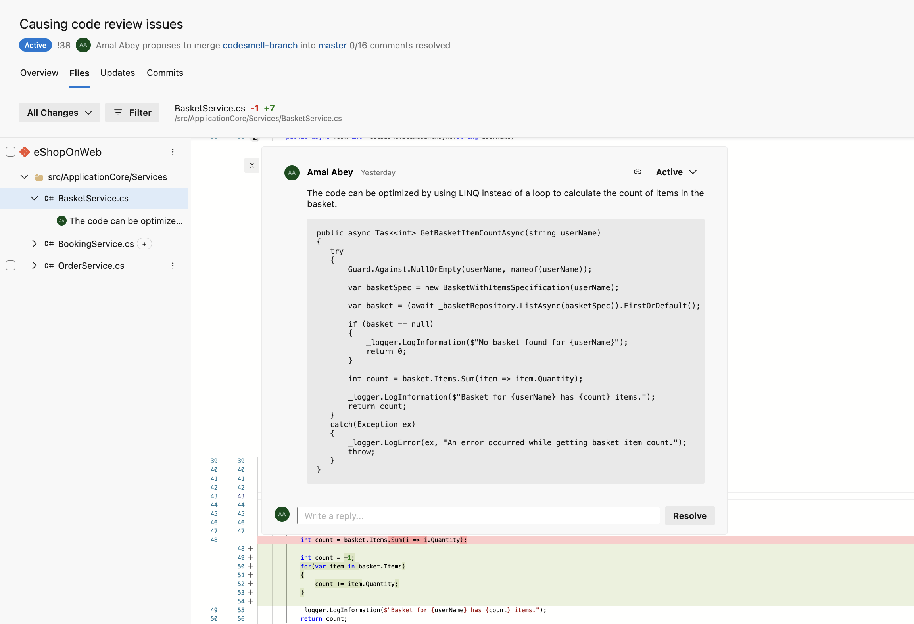

# Virtual Contributor
Latest development in Large Language Models (LLMs) such as OpenAI GPT have open the doors to leverage their capability to review and find bugs in code changes. Contributor is a tool (bot) that can automatically provide feedback on code changes using the underlying LLM APIs (e.g. OpenAI). The tool can automatically decorate Pull Requests with comments and code suggestions relevant to the changed code blocks.



## How does it work?
Contributor uses the APIs provided by the source control provider (currently only Azure Repos is supported) to retrieve code changes. It then uses OpenAI LLM to obtain the set of methods/functions changed and should be reviewed. Once it knows the semantic change set, it uses OpenAI LLM again to obtain code review suggestions for each method/function. The tool then, decorates the Pull Request files using the corresponding APIs. Contributor uses [langchain](https://github.com/hwchase17/langchain) to work with LLMs.

## Getting Started  
You need access to below before you can run the solution:
- Obtain API keys from either [OpenAI](https://platform.openai.com/playground) or [Azure OpenAI](https://azure.microsoft.com/en-au/products/cognitive-services/openai-service) services. In case of Azure OpenAI, you need to request the service to be enabled in your tenant and have a valid model deployed to the service.
- Create a [PAT](https://learn.microsoft.com/en-us/azure/devops/organizations/accounts/manage-personal-access-tokens-via-api?view=azure-devops) to allow access to your Azure DevOps account. This PAT will be used to register webhooks, retrieve Pull Request contents and post comments to Pull Requests.

### Setup Environment
The solution uses [poetry](https://python-poetry.org/docs/basic-usage/) to manage dependencies. Install dependencies using below and ensure you are in a poetry shell before proceeding to the next steps:
```
poetry install
```

### Configure Settings
All settings are configured in the `.env` file at the root of the solution. You can rename the `example.env` to `.env` and supply your API keys and other configuration parameters in this file.

If you are using Azure OpenAI services below settings needs to be configured:
```
MODEL_NAME="gpt-35-turbo"
OPENAI_API_TYPE=azure
OPENAI_API_VERSION=2023-07-01-preview
DEPLOYMENT_NAME="name of the model deployment in your azure OpenAI service"
OPENAI_API_BASE=https://<your-azure-openai-service-name>.openai.azure.com/
OPENAI_API_KEY="Key from Azure OpenAI service"
```

If you are using OpenAI services, below settings to be configured instead of above:
```
OPENAI_API_TYPE=openai
MODEL_NAME="gpt-3.5-turbo"
OPENAI_API_KEY="Your API Key from OpenAI"
```
Then, configure the parameters to connect to your Azure DevOps project:
```
AZURE_DEVOPS_ORG="your org short name"
AZURE_DEVOPS_PROJECT="project name"
AZURE_DEVOPS_PAT="register a personal access token in your Azure DevOps account"
```

### Running the Solution
First, you need to register the webhook as a service hook in your Azure DevOps project. A webhook requires a publicly accessible domain, so if you are running the solution locally you can use either [ngrok](https://ngrok.com/) or [Visual Studio Dev Tunnels](https://learn.microsoft.com/en-us/connectors/custom-connectors/port-tunneling) to publicly expose your local API.

Run ngrok to expose local port 5000 over internet:
```
ngrok http 5000
```
> *Note*: copy the public domain name from ngrok to use in the next step

Run below command to register webhooks in Azure DevOps:
```
python -m platform_integration.azure_devops register https://<ngrok domain name from above>
```

Serve, the webhook API that responds to Pull Request Create/Update events by getting feedback for code changes and posting them to your Pull Request as comments:
```
python -m platform_integration serve
```

### Test the Solution
You can test the solution by updating an existing Pull Request or by creating a new one. You should see code review comments posted on the PR.